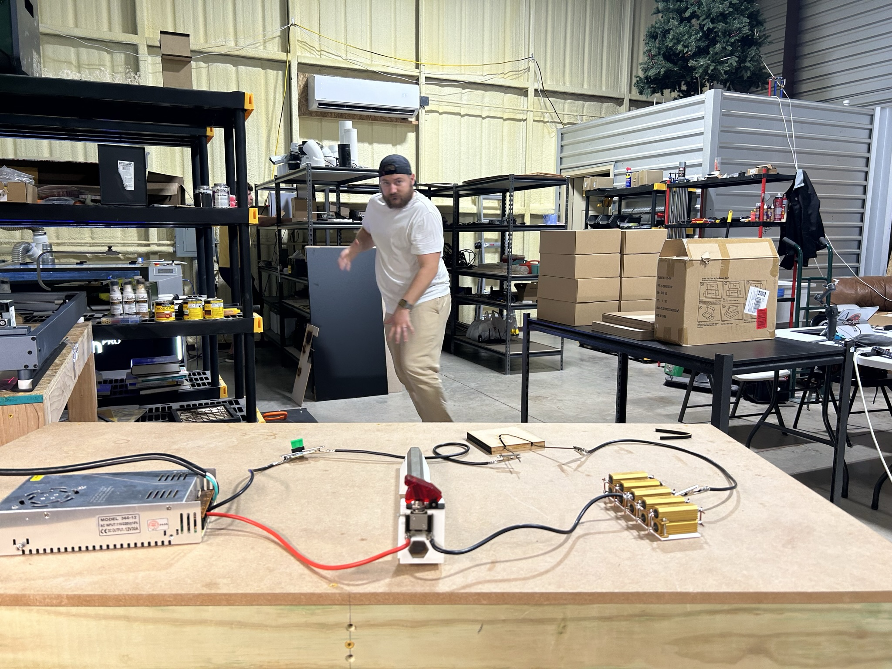
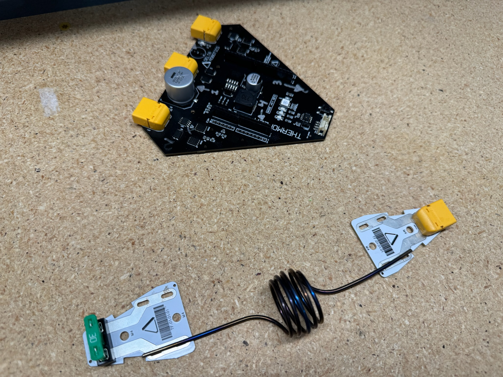

# Welcome to Delta Docs

***

## A Quick Disclaimer!

You're going to read a lot here about open-source this, commercial use that, and even the scary; _protected material..._

All you need to know for now is this:

1. If something is labeled "Open-source" it means you can use it, free of charge! Do whatever you want with it to your hearts content. With this important exception: You may not use said open-source materials to create a product that you sell, license, or use for any commercial activity.
2. If something is labeled as "Free for Commercial Use" than this means that either for a charge or no charge at all (this is at Delta Robotics' discretion), you can take this listed content or product on the repository and use it for commercial activity.
3. If you are unsure as to whether or not something is or is not free for commercial use, contact us and assume it is protect and thus not free for commercial use until we say otherwise.

On to the fun stuff....

***

## Our Mission at Delta:

Who is Delta? What is Delta? Where is Delta?&#x20;

Delta Robotics is a Texas-based tech startup looking to revolutionize the robotics industry with cutting edge artificial muscle technologies. We are a small team dedicated to taking our technology and putting it in the hands of people like you and making products people need! Whether your a developer, tech enthusiast, or problem solver, we want dedicated users like you to interact and utilize our technology.&#x20;

How do we do seek to accomplish this?

We at Delta envision a robust open-source community helping us build professional robotics systems like powered prosthetics, assisted mobility devices, and general humanoid robotics. We want to see a world where our technology powers innovation, improves lives, and enables tech companies and enthusiasts to create devices never before possible.

<figure><figcaption>
Prototype Mark 1.0 Muscle with Evil Genius Kevin Fehr 
</figcaption></figure>

## A Short Blurb About Us

Delta Robotics is pioneering the development of advanced Nitinol artificial muscle technology to revolutionize the robotic and prosthetic spaces. We make this technology accessible and affordable, reducing barriers for inventors to create their own bionic devices with ThermoFlex™ at the core. Our dual approach combines proprietary ThermoFlex™ actuators with open-source control systems and training methods, empowering a vibrant community to drive biomechatronic advancement.

<figure><figcaption></figcaption></figure>

[Click here for a more in-depth description of our company and business model.](welcome-the-delta-docs-home/about-us.md)

## Disclaimer

## Quick Links

Need to find a place outside of Delta's website that's important/relevant to us? You'll probably find it here.
