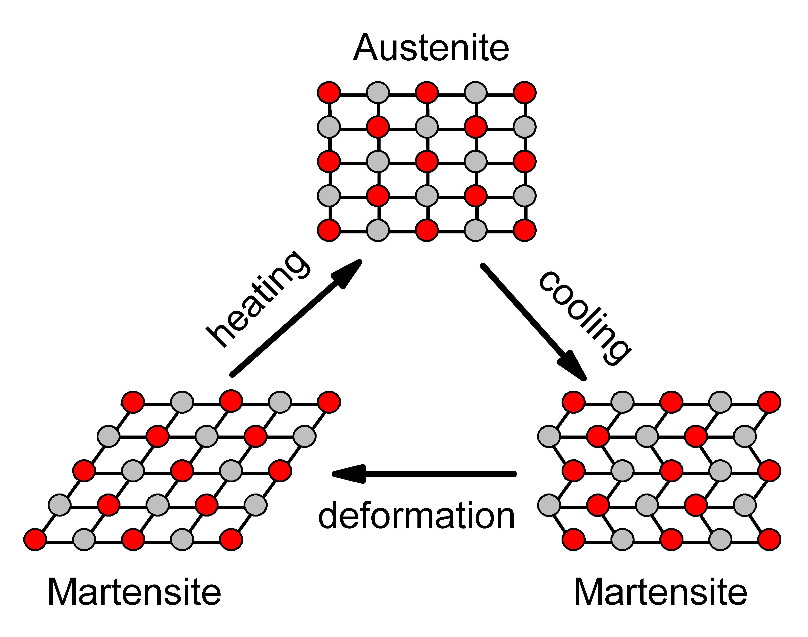
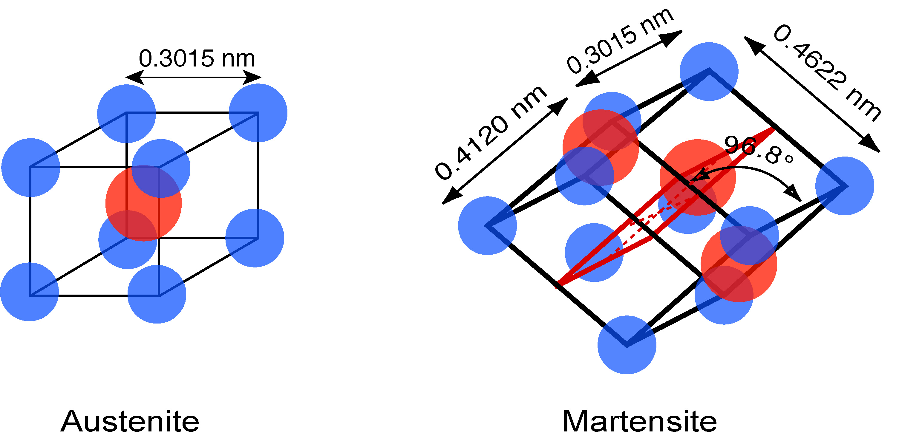
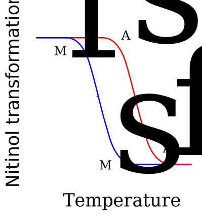
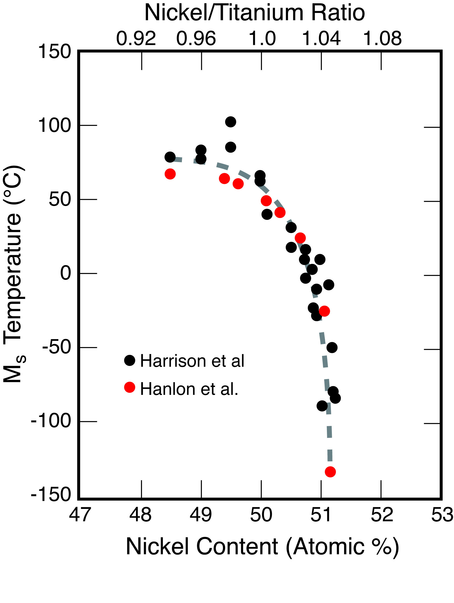

# What is Nitinol?

## Shape Memory Alloys

Shape Memory Alloys are a class of materials which can store and release energy by transitioning between different phases. They are advantageous over traditional actuators because these alloys can provide a greater force per unit of volume and weight. This leads to a more lightweight and compact design in robotics applications. Shape Memory Alloys gained their name because they can be trained to return to a specific shape, and they can perform this cycle thousands of times.

## Material Phases

Nitinol (Nickel-Titanium alloy) has three main phases; Twinned Martensite, De-twinned Martensite, and Austenite phases. The Image below shows the atomic phases of Nitinol during heating and cooling cycles. The process of de-twinning does not change the mechanical properties of the alloy, it only changes the alignment of the atoms, storing energy.

<figure><figcaption>
De-twinned Martensite (left), Twinned Martensite (right), Austenite (top)
</figcaption></figure>

### Transitions as an Actuator

#### Contraction

When heated, the actuator shortens and the Nitinol transitions from the De-twinned Martensite phase to the Austenite phase.

#### Cooling Cycle

When power is off and the muscle is left to dissipate heat, the Nitinol transitions from the Austenite phase to the Twinned Martensite phase.

#### Under Load

While the actuator is under stress and being deformed (for example, being stretched out by a water jug or pulled), the Nitinol is transitioning from the Twinned to the De-twinned Martensite phase.

### Phase Structure

Nitinol exhibits different crystal lattice structures depending on its phase:

<table data-card-size="large" data-view="cards" data-full-width="true"><thead><tr><th></th><th></th><th data-hidden data-card-cover data-type="files"></th></tr></thead><tbody><tr><td><strong>Austenite Phase</strong></td><td>In the high-temperature phase, Nitinol has a B2 cubic structure. This is a body-centered cubic (BCC) lattice where nickel and titanium atoms are positioned at the corners and the center of the unit cell. This phase is much more dense than the Martensite phase because of its cubic structure.</td><td></td></tr><tr><td><strong>Martensite Phase</strong></td><td>In the low-temperature phase, Nitinol transforms into Martensite, which has a less dense, elongated, structure. This phase can have different forms depending on the specific alloy composition and thermal treatment. The most common form is the Monoclinic B19' Structure; it has a distorted lattice, allowing for significant deformation and the shape memory effect. </td><td></td></tr></tbody></table>

<figure><figcaption>
Lattice comparison between the Austenite and Martensite phases of Nitinol.
</figcaption></figure>

### Temperature Data

Nitinol has a hysteretic curve for temperature vs strain/transformation. Below is a image of this curve with Austenite start (As), Austenite finish (Af), Martensite start (Ms), and Martensite finish (Mf) phases listed.

<figure><figcaption></figcaption></figure>

### Alloy Ratios

Delta uses a 90 Degree Celsius Activation Temperature Nitinol alloy. It's activation temperature, otherwise known as Austenite finish (Af), changes based on the Ratio of Nickel to Titanium. A greater Nickel percentage in the alloy's composition lowers the activation temperature.&#x20;

<figure><figcaption></figcaption></figure>

## Material Properties

The tables below outline the [generalized properties](https://en.wikipedia.org/wiki/Nickel_titanium) of Nitinol alloy in its different phases. Click the links for more information about any of the specific properties mentioned.

### Austenite

| Material properties                                                                             | Value                       |
| ----------------------------------------------------------------------------------------------- | --------------------------- |
| [Melting point](https://en.wikipedia.org/wiki/Melting_point)                                    | 1,310 °C (2,390 °F)         |
| [Density](https://en.wikipedia.org/wiki/Density)                                                | 6.45 g/cm3 (0.233 lb/cu in) |
| [Electrical resistivity](https://en.wikipedia.org/wiki/Electrical_resistivity_and_conductivity) | 82×10−6 Ω·cm                |
| [Thermal conductivity](https://en.wikipedia.org/wiki/Thermal_conductivity)                      | 0.18 W/cm·K                 |
| [Coefficient of thermal expansion](https://en.wikipedia.org/wiki/Thermal_expansion)             | 11×10−6/°C                  |
| [Magnetic permeability](https://en.wikipedia.org/wiki/Magnetic_permeability)                    | < 1.002                     |
| [Magnetic susceptibility](https://en.wikipedia.org/wiki/Magnetic_susceptibility)                | 3.7×10−6 emu/g              |
| [Elastic modulus](https://en.wikipedia.org/wiki/Elastic_modulus)                                | 75–83 GPa                   |
| [Yield strength](https://en.wikipedia.org/wiki/Yield_strength)                                  | 195–690 MPa                 |
| [Poisson's ratio](https://en.wikipedia.org/wiki/Poisson's_ratio)                                | 0.33                        |

### Martensite

These values are applicable to both the Twinned and De-twinned states.

| Material properties                                                                             | Value                       |
| ----------------------------------------------------------------------------------------------- | --------------------------- |
| [Melting point](https://en.wikipedia.org/wiki/Melting_point)                                    | 1,310 °C (2,390 °F)         |
| [Density](https://en.wikipedia.org/wiki/Density)                                                | 6.45 g/cm3 (0.233 lb/cu in) |
| [Electrical resistivity](https://en.wikipedia.org/wiki/Electrical_resistivity_and_conductivity) | 76×10−6 Ω·cm                |
| [Thermal conductivity](https://en.wikipedia.org/wiki/Thermal_conductivity)                      | 0.086 W/cm·K                |
| [Coefficient of thermal expansion](https://en.wikipedia.org/wiki/Thermal_expansion)             | 6.6×10−6/°C                 |
| [Magnetic permeability](https://en.wikipedia.org/wiki/Magnetic_permeability)                    | < 1.002                     |
| [Magnetic susceptibility](https://en.wikipedia.org/wiki/Magnetic_susceptibility)                | 2.4×10−6 emu/g              |
| [Elastic modulus](https://en.wikipedia.org/wiki/Elastic_modulus)                                | 28–40 GPa                   |
| [Yield strength](https://en.wikipedia.org/wiki/Yield_strength)                                  | 70–140 MPa                  |
| [Poisson's ratio](https://en.wikipedia.org/wiki/Poisson's_ratio)                                | 0.33                        |
