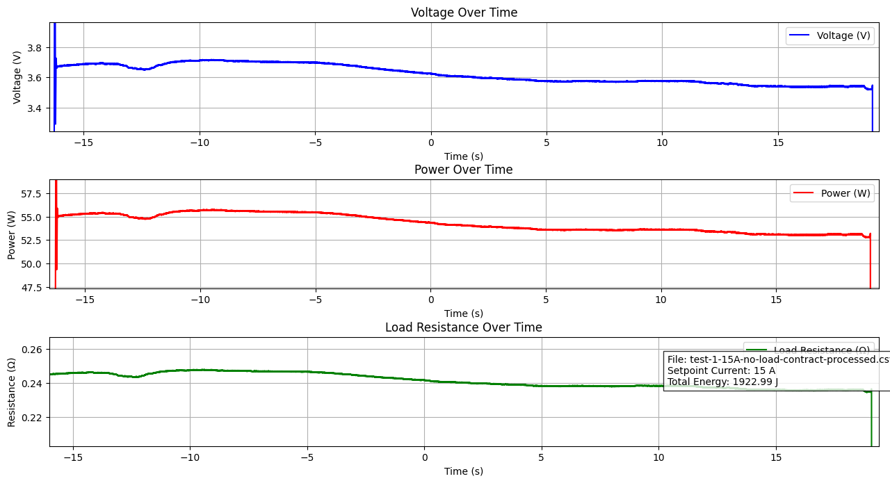

# ThermoFlex™

## ThermoFlex Mk.1 Muscle

Our first product is a dual-coil Nitinol artificial muscle, powered electrically and capable of lifting 25 pounds in 2 seconds with a 25 V battery.

### Specifications

<table><thead><tr><th>Parameter</th><th width="249">Minimum</th><th>Maximum</th></tr></thead><tbody><tr><td>Nominal voltage</td><td>3 V</td><td>25 V (highest tested)</td></tr><tr><td>Resistance</td><td>235 mOhms (Af)</td><td>250 mOhms (Mf)</td></tr><tr><td>Instantaneous Current</td><td>(Dependent on PWM %)</td><td>106 A (2s contraction)</td></tr><tr><td>Hold Current</td><td>TBD</td><td>TBD</td></tr><tr><td>Pull Force</td><td>5 lbs (Extension return force)</td><td>25 lbs</td></tr><tr><td>Contraction Time</td><td>-</td><td>2s @ 25 V</td></tr></tbody></table>

Question about specific values? Ask Kevin: [kevin@deltaroboticsinc.com](mailto:kevin@deltaroboticsinc.com)

### Contraction Test Results

<figure><figcaption></figcaption></figure>

**Load**: None

**Set Current:** 15 A

**Time to Contract (TTC)**: 35.311 s

**Total Power Consumption**: 1923 J (\~0.5 Wh)
