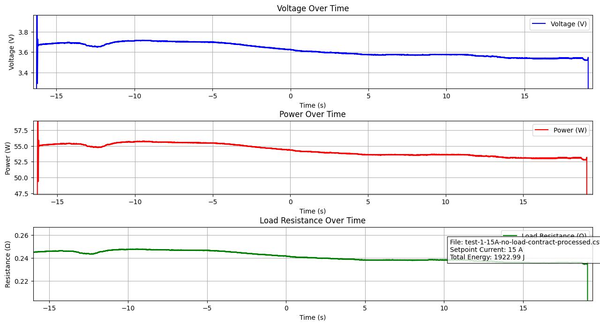

# TF Mk.1 Muscle

**Pronunciation:** _Ther-moh-fleks mark one muscle_

Also visit our [getting started guide](../../tutorials/thermoflex-tm/getting-started-with-our-evaluation-kit/) to see what's possible with the ThermoFlex™ kit and accompanying [Python API](../../software/thermoflex-tm-python-api.md).

<figure><figcaption></figcaption></figure>

### Specifications

<table><thead><tr><th>Parameter</th><th width="249">Minimum</th><th>Maximum</th></tr></thead><tbody><tr><td>Nominal voltage</td><td>3 V</td><td>25 V</td></tr><tr><td>Resistance</td><td>235 mOhms (Af)</td><td>250 mOhms (Mf)</td></tr><tr><td>Instantaneous Current</td><td>(Dependent on PWM %)</td><td>106 A (2s contraction)</td></tr><tr><td>Pull Force</td><td>5 lbs (Extension return force)</td><td>25 lbs</td></tr><tr><td>Contraction Time</td><td>-</td><td>2s @ 25 V</td></tr></tbody></table>

Question about specific values? Ask Kevin: [kevin@deltaroboticsinc.com](mailto:kevin@deltaroboticsinc.com)

### Contraction Test Results

**Setup:** A variable power supply set to 15 A and an oscilloscope to track the following values.

**Load**: None

**Set Current:** 15 A

**Time to Contract (TTC)**: 35.311 s

**Total Power Consumption**: 1923 J (\~0.5 Wh)

<figure><figcaption>
What this means: The graph shows the total power consumption for a full actuation completed over 35 seconds. Standard actuations with the ThermoFlex Node Controller are under 2 seconds.
</figcaption></figure>

