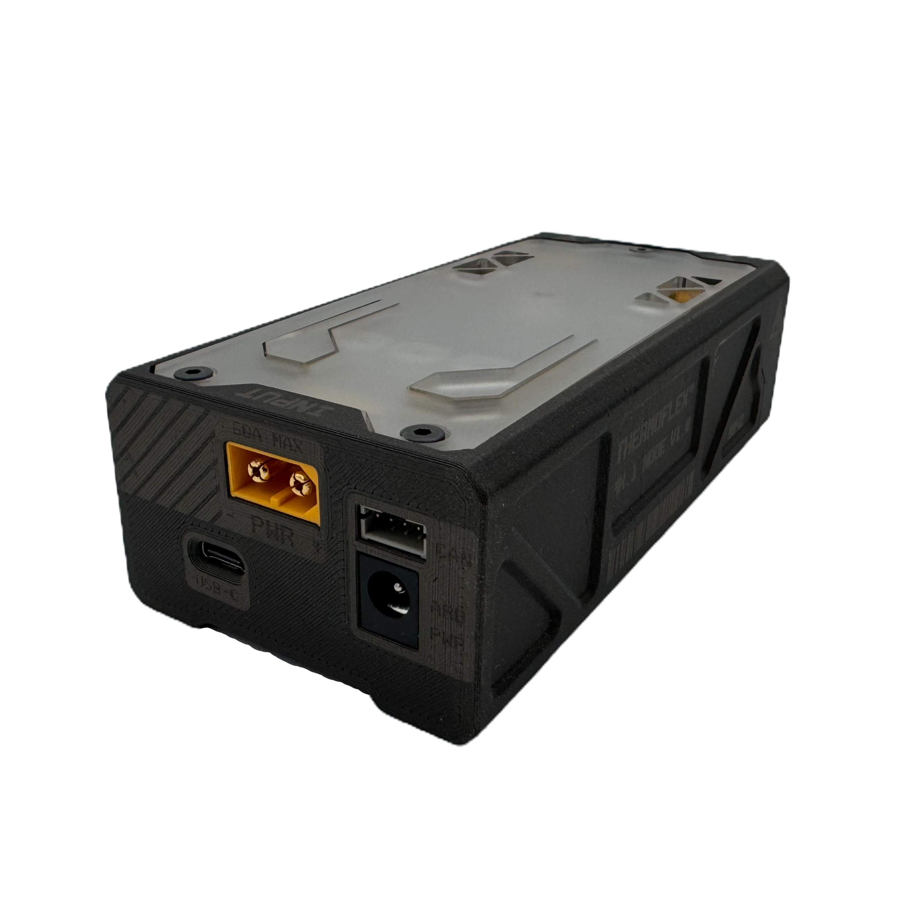

# TF Node Controller

**Pronunciation:** _THER-moh-fleks nohd kun-TROH-lur_

Also visit our [getting started guide](../../tutorials/thermoflex-tm/getting-started-with-our-evaluation-kit.md) to see what's possible with the ThermoFlex™ kit and accompanying [Python API](../../software/thermoflex-tm-python-api.md).

<figure><figcaption></figcaption></figure>

### ⚡ What It Does

The ThermoFlex™ Node is your desktop control lab for smart materials. Originally built for shape memory alloys like Nitinol, it also supports experimental actuators like twisted polymer (TCP) muscles and other Joule-heated materials (experimental, reach out for more information).

From muscle contraction to shape-setting, this board gives you tight control over current, temperature, and timing—all from a USB-C cable or CAN network.\
Use it to experiment, automate, prototype, or break stuff (in a controlled, data-driven way).

***

### 🧪 Specs at a Glance

| Parameter                              | Min    | Max             |
| -------------------------------------- | ------ | --------------- |
| Input Voltage                          | 0 V    | 40 V            |
| Input Current                          | TBD    | 65 A continuous |
| Output Current (Shared across M1 + M2) | 0 A    | 60 A continuous |
| Output Current (Instantaneous Total)   | 0 A    | 110 A           |
| PWM Frequency                          | —      | 100 Hz          |
| Resistance Measurement                 | 100 mΩ | 5.00 Ω          |

The controller measures **current**, **voltage**, and **resistance**, allowing it to estimate wire temperature and (experimentally) detect SMA phase changes.

Need deeper specs or edge-case testing? [Ask Mark](mailto:mark@deltaroboticsinc.com), our ThermoFlex Node Controller mastermind. (Warning, bright lights WILL scare him)

***

### 🧩 Hardware Features

Everything you need for smart material actuation in one dense, overengineered package:

* **Arduino R4 Minima (included)** – custom firmware, programable if needed
* **XT60 Male Input** – for clean, high-current power
* **2× XT60 Female Outputs** – labeled M1, M2 (shared 60 A total)
* **2× JST Sensor Ports** – connect thermistors, strain gauges, etc.
* **USB-C** – serial + power + firmware flashing
* **CAN Bus (JST)** – control up to 127 devices from a single USB
* **Integrated cooling fan** – powered from XT60 IN
* **Passthrough Arduino headers** – analog + digital IO, accessible for debugging/expansion
* **RGB LED** – used for device status signals
* **AUX Button** – reprogrammable for reset, trigger, or anything else
* **DC jack (Arduino)** – optional secondary power for Arduino MCU only
* **Sick AF 3D-Printed Enclosure** – with frosted acrylic top, compliant buttons, visible status and power terminals (and yes, that's the official name)

***

### 🔌 Setup Instructions

1. **Power** the board via XT60 IN (12–24 V recommended)
2. **Connect** actuators to XT60 OUT ports (M1, M2)
3. **Plug in USB-C** for serial control or firmware flashing
4. **Add sensors** via JST ports if you want extra data
5. **Use CAN JST ports** to daisy-chain multiple controllers (if needed)

Also see the [ThermoFlex Python API](../../software/thermoflex-tm-python-api.md) for more information on setup.

***

### 🧠 Smart Control Features

This isn’t just a current dumper—it’s a feedback-rich control system.

* **Resistance Sensing** → Detects SMA activation, cool-down, or failure
* **Current + Voltage Monitoring** → For safety and thermal estimation
* **PWM Output** → Adjustable control over heating curve
* **CAN + Serial Communication** → Control locally or over networks
* **Programmable LED + Button** → Customize interface or system states
* **Experimental Features** → Phase-state detection, live temperature inference, auto-profiling (in dev)

If you're using this for non-SMA materials (like TCP), shoot us a message. We'll help you tune it.

***

### ❄️ Cooling Notes

This board has an integrated fan, but the thermal load depends heavily on your use case:

| Use Case                                    | Cooling Needs                                                                     |
| ------------------------------------------- | --------------------------------------------------------------------------------- |
| <20 A, short duty cycles (normal operation) | Passive airflow sufficient                                                        |
| 20–40 A continuous                          | Internal fan helps, monitor temps                                                 |
| 40–60 A or shape-setting                    | Caution: airflow may not be enough—use external fan, monitor MOSFET temps closely |

Shape-setting heats things up fast. We’re still testing long-session limits—if you're running extended training cycles, **keep an eye on the heat** and let things cool between rounds.

**If you are only using the controller to power ThermoFlex muscles normally with the Python API, do not worry about this section.**

***

### ✅ Best Practices

| ✅ Do                                                | 🚫 Don’t                                     |
| --------------------------------------------------- | -------------------------------------------- |
| Use XT60s or heavy-gauge wires (AWG 12 recommended) | Solder wires to high-current pads            |
| Keep power and actuator wiring short + clean        | Use jumper wires for >5 A loads              |
| Monitor resistance + current in software            | Assume constant load behavior                |
| Actively cool during shape-setting                  | Expect the fan alone to handle extreme temps |

***

### 🧰 Dev Notes

Under the hood: it's a powerful Arduino shield—with extra brains.

* **USB-C Python Serial/CAN API** (command/control/monitor)
* **CAN Bus** for scalable setups
* **All Arduino pins** are accessible for all your hacking needs
* **Future Features (in dev)**:
  * Live plotting via Delta Client
  * Auto actuator type detection
  * Thermal feedback loops

Want to contribute or experiment? We’d love to see what you build with it.

***

### 📚 Further Reading

* [Arduino R4 Minima Docs](https://docs.arduino.cc/hardware/uno-r4-minima)
* [CAN Bus Simple Introduction](https://www.csselectronics.com/pages/can-bus-simple-intro-tutorial)

***
