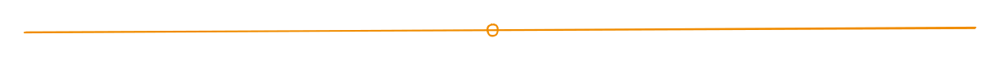

# Welcome to Delta Docs

## <mark style="color:orange;">A Quick Disclaimer</mark>

You're going to read a lot throughout our documentation about open-source and commercial use.

All you need to know to start is this:

1. If something is labeled "Open Source" it means you can use it, free of charge!   You can create, improve, and distribute the material in any way that you desire.
2. If something is labeled as "Commercially Licensed," it means that Delta Robotics maintains commercial protection over that technology.  We may or may not be willing to license this intellectual property to you for commercial use.
3. All publicly released Delta Robotics designs or products are available for use within personal projects.  This means that if you find a schematic officially released by us, you may reproduce the work within the constraints of personal use.
4. When in doubt, please reach out.  We are available via the contact information [here](https://docs.deltaroboticsinc.com/getting-started/contact-us) or on the[ discord server](https://discord.gg/DVpnTzzYqr).

On to the fun stuff....

## <mark style="color:orange;">Our Mission at Delta</mark>

We at Delta envision a vibrant open-source community working together to build robotics systems such as powered prosthetics, assisted mobility devices, and humanoid robots.  We wish to participate in such a community in order to power innovation, improve lives, and enable other companies and enthusiasts to create devices never before possible.

<figure><figcaption>
Nitinol shape test prototype with our CEO, Kevin Fehr 
</figcaption></figure>

## <mark style="color:orange;">About Us</mark>

Who is Delta?  What is a Delta?  Where is Delta?&#x20;

The Greek delta symbol, Δ, is the mathematical representation of change.  It is our goal to change the engineering mindset about what an actuator can do, and build devices better suited for a bionic future.

Delta Robotics is a Texas-based tech startup developing advanced Nitinol artificial muscle technology to revolutionize the robotics and prosthetic spaces.  We are a small team dedicated to taking our technology and putting it in the hands of inventors and making products people need!  Whether you're a professional engineer, tech enthusiast, or problem solver, we want dedicated users like you to shape our technology and work with us to build bionic devices.&#x20;

We intend to make these technologies accessible and affordable, thus reducing barriers of entry for inventors to create their own bionic devices. Our dual headed approach combines our proprietary ThermoFlex™ actuators with open-source control systems and training methods, empowering a vibrant community with the shared goal of driving biomechatronic advancement.&#x20;


Want to learn more about us?

[Click here for a more in-depth description of our company and business model.](about-us.md)

