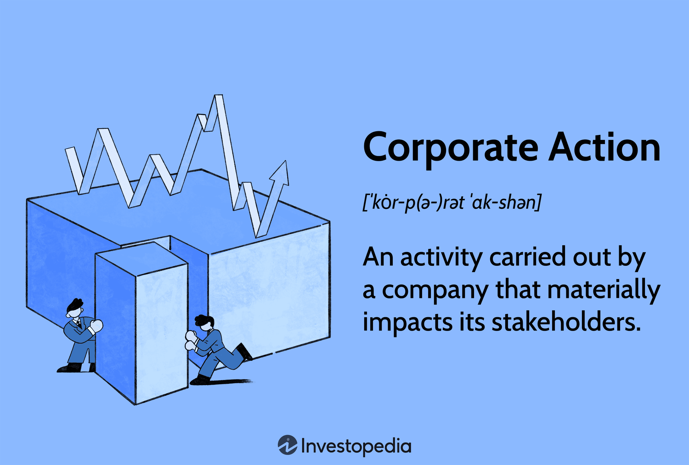

# About Us

ThermoFlex™

<figure><figcaption></figcaption></figure>

 

<figure><figcaption></figcaption></figure>

<figure><figcaption></figcaption></figure>

 

<figure><figcaption></figcaption></figure>

<figure><figcaption></figcaption></figure>

 

<figure><figcaption></figcaption></figure>

<table data-card-size="large" data-view="cards" data-full-width="true"><thead><tr><th></th><th></th><th data-hidden data-card-cover data-type="files"></th></tr></thead><tbody><tr><td><h2>What is Delta doing?</h2></td><td>Delta Robotics is pioneering the development of advanced artificial muscle technology using Nitinol to revolutionize the bionic and robotic spaces.</td><td></td></tr><tr><td></td><td></td><td><a href="../.gitbook/assets/corporateaction.asp-FINAL-d8a1d133e30f4b46adf67479f19332e7.png">corporateaction.asp-FINAL-d8a1d133e30f4b46adf67479f19332e7.png</a></td></tr><tr><td><h2>What problem are we solving?</h2></td><td>Delta Robotics is pioneering the development of advanced artificial muscle technology using Nitinol to revolutionize the bionic and robotic spaces.</td><td><a href="../.gitbook/assets/businessman-hand-holding-blocks.jpeg">businessman-hand-holding-blocks.jpeg</a></td></tr><tr><td><h2>How are we solving this?</h2></td><td>At Delta Robotics, we address these issues by making our Nitinol technology accessible and affordable with a open-source repository accompanying it. By placing our technology at the core of their creations, we empower individuals to build innovative and cost-effective bionic devices, thus democratizing access to life-changing technology.</td><td><a href="../.gitbook/assets/NiTi_structure_transformation.jpg">NiTi_structure_transformation.jpg</a></td></tr></tbody></table>

## What is the technology behind the solution?



Recognizing Nitinol's difficulty to work with outside research settings, we aim to make it more accessible for bionic development. Our dual approach involves creating patented ThermoFlex™ Nitinol actuators, which serve as the core technology for cutting-edge prosthetics and mobility devices, while fostering a vibrant open-source community. We are committed to keeping our control systems and Nitinol training methods open-source, bringing this knowledge out of research labs and into the hands of hobbyists and innovators.&#x20;



Our community is empowered to collaborate on open bionic designs using the ThermoFlex™ control software, our Nitinol shape-setting methods, and accessible hardware schematics. By maintaining commercial control over our own actuator designs, Delta Robotics ensures a sustainable revenue stream, positioning us as the primary supplier of this critical technology. Simultaneously, our open-source initiatives promote widespread collaboration, driving advancements in robotic and prosthetic solutions and accelerating the development of transformative, life-enhancing technologies.



## Delta Business Model

At Delta Robotics, we aim to tackle both proprietary, patented development of bionic devices while also fostering an open-source control system for our growing community. Doing so is a difficult task that requires rigorous transparency with both investors and open-source developers on what technology is protected and which is open for contribution.

### What does Open-Source look like to Delta?

At the heart of our innovation and company model is a mission to maintain an open-source repository for our consumers and developers whilst maintaining the financial viability for our company to stay alive and keep the lights on! What this looks like for you is access to an open-source repository that will give you the knowledge, guides, and community driven projects/content to create your own devices. We understand that not everyone has the time, money, and expertise to create their own devices.  To sustain our operations, we sell consumers a product if they don't want to or can't create their own devices.

### Commercial Use

While we believe in having a robust and open-source community, we can't survive without a monetary stream.  All designs contributed on by the community retain full open-source benefits, including commercial use.  Key products, like the ThermoFlex Mk.1, are patent-protected devices that will be protected commercially by Delta Robotics.  See the "Open Source Initiatives" and "Protected Intellectual Property" sections below to see which projects are community-driven and which are commercially protected.

<mark style="color:orange;">**TLDR: Our mission is to protect the global right to access this technology and our commercial right to monetize the technology.**</mark>

### Open Source Initiatives

For our open-source effort, the Nitinol control system and shape-set training process are community projects.  The design of Delta Robotics muscle controllers and the firmware that run them will be forever community driven. &#x20;

We believe that Nitinol actuators will have a strong role in the explosion of advanced robotic systems.  The number one barrier-to-entry for users of this technology is access to a control system.  Research has proven that the material can be precisely controlled for position with force feedback simply by measuring the resistance of the material.  Our goal is to bring that research into the open for anyone to control their custom Nitinol actuators or use an existing one like the ThermoFlex™ Mk.1 Duo.

Additionally, shape-setting Nitinol wire into a new trained geometry can be accomplished via electrical heating with resistance feedback.  This process is difficult to refine and is currently a trade secret within other Nitinol-producing companies.  Delta Robotics aims to develop extensive documentation, research papers, and electronics in order to democratize the creation of new Nitinol actuators.  You can buy our muscles or learn how to make your own!

### Protected Intellectual Property

As a corporation, Delta Robotics has a responsibility to its shareholders and employees to grow and seek profit from our efforts.  Delta is a major contributor to this Nitinol open-source initiative, with a business interest in its success.  In doing so, we will retain the commercial rights to actuator designs researched and produced by the company.  Currently, this includes our ThermoFlex™ Mk.1 platform and our planned ThermoFlex™ Mk.2.

#### Our IP Protection Efforts

1. The ThermoFlex™ Nitinol actuators are patented with public, open designs authorized for personal use. Commercial use of the designs by any other individual or entity requires permission from, and royalties paid to Delta Robotics.  With the training process and control system open-source, community members can produce their own designs with the commercial rights that come along with them.
2. Delta Robotics Inc. branding will remain exclusive to our company for use in our products. Anything made for personal use by community members may retain the Delta Robotics branding but must be disclosed as personal creations when sharing with the public. Commercial products that do not directly use parts sourced from Delta Robotics may not feature Delta Robotics branding.

<mark style="color:red;">#TODO Add link to legal documentation</mark>

### Medical Availability

With this business model, Delta Robotics maintains protection over our research efforts without withholding anything from the community.  The entire Nitinol actuation system can be reproduced for personal use with portions completely open.

As we move forward, the principle that medical devices should be available to the people who need them most is our driving value.  We believe that these actuators will be critical components in prosthetic devices and should be available to produce if a person has the need and the know-how.  Concurrently, protecting commercial viability of our products is paramount to our growth.  This model will grow both Delta Robotics and our Nitinol community in the best way possible.

